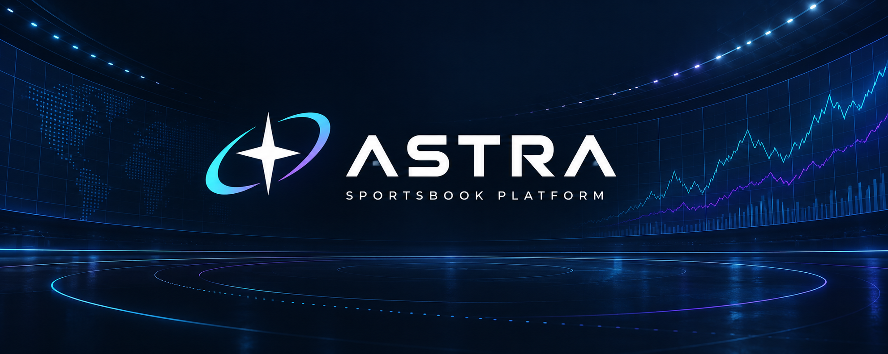

<p align="center">
  
</p>

<h1 align="center">ASTRA</h1>

<p align="center">
  Telegram-first sportsbook platform with an interactive Mini App and a financially safe backend foundation.
</p>

<p align="center">
  <a href="https://github.com/aww1n/astra-platform/actions/workflows/ci.yml"></a>
  
  
  
</p>

> [!IMPORTANT]
> This repository runs in **STAGING / MOCK mode**. Real-money betting, deposits, and withdrawals remain disabled until licensing, jurisdiction, KYC/AML/KYT, custody, provider, security, and production-readiness requirements are satisfied.

## Included

- Responsive Mini App UI with live/prematch events, sport filters, search, markets, and bet slip.
- DEMO bet placement, bet history, profile, wallet, deposit, withdrawal, KYC, responsible-gambling, transactions, and support flows.
- NestJS/Fastify API with health, bootstrap, events, server quotes, and idempotent bet placement.
- Fixed-point `Money` and decimal odds; authoritative calculations never use floating point.
- Double-entry ledger checks and PostgreSQL-enforced balance/immutability invariants.
- Idempotency, inbox/outbox schema, DEMO/PRODUCTION isolation, and financial integration tests.
- Full architecture baseline covering betting, settlement, payments, compliance, security, operations, and deployment.

## Platform at a glance

| Layer | Responsibility | Current state |
| --- | --- | --- |
| Mini App | Discovery, markets, bet slip, wallet and account flows | Interactive prototype |
| API | Health, bootstrap, events, quotes and bet placement | First vertical implemented |
| Financial kernel | Fixed-point money, double-entry ledger and invariants | Implemented and tested |
| Data layer | PostgreSQL schema, idempotency and inbox/outbox | Baseline implemented |
| Integrations | Telegram, sports data, KYC/AML/KYT and custody | Mock adapters / contracts required |

## Structure

```text
apps/api/                   NestJS/Fastify API
packages/money/             fixed-precision money and odds
packages/ledger/            double-entry ledger invariants
packages/database/          PostgreSQL migrations and integration tests
site/dist/                  interactive Mini App prototype
docs/                       architecture and readiness baseline
infra/docker/               local PostgreSQL and Redis
```

## Run locally

Requirements: Node.js 24+, npm, PostgreSQL client tools, and optionally Docker.

```bash
npm install
npm run check
npm run start:api
```

API health: <http://127.0.0.1:4300/api/v1/health>

In a second terminal:

```bash
cd site
python3 -m http.server 4173 --bind 127.0.0.1 --directory dist
```

Open <http://127.0.0.1:4173>.

### Local services with Docker

```bash
docker compose -f infra/docker/compose.yaml up -d
```

## Configuration

Copy `.env.example` to `.env`. Never commit real credentials. Safe local mode:

```env
APP_ENV=staging
FINANCIAL_MODE=STAGING
INTEGRATION_MODE=MOCK
PRODUCTION_REAL_MONEY=false
```

The API rejects real-money mode when MOCK integrations are active.

## Verification

```bash
npm run check
npm audit --omit=dev
```

This runs strict TypeScript checks, unit tests, and PostgreSQL financial-kernel integration tests.

## Architecture

Start with [`docs/README.md`](docs/README.md). Non-negotiable principles:

1. PostgreSQL double-entry ledger is the financial source of truth.
2. Money-moving commands are atomic and idempotent.
3. Accepted bets freeze odds, ruleset, policy, and evidence versions.
4. Posted history is immutable; corrections use reversals.
5. The Mini App is untrusted; critical decisions stay on the backend.
6. DEMO and PRODUCTION funds and infrastructure never mix.

### Documentation map

- [System architecture](docs/architecture/system.md)
- [Betting lifecycle](docs/architecture/betting.md)
- [Financial kernel](docs/architecture/financial-kernel.md)
- [Payments and custody](docs/architecture/payments.md)
- [Compliance](docs/architecture/compliance.md)
- [Telegram integration](docs/architecture/telegram.md)
- [Database model](docs/database/erd.md)
- [API contracts](docs/api/contracts.md)
- [Testing strategy](docs/testing/strategy.md)
- [Deployment](docs/operations/deployment.md)
- [Roadmap](docs/roadmap.md)

## Security and status

Read [`SECURITY.md`](SECURITY.md) and [`docs/security/threat-model.md`](docs/security/threat-model.md). The UI prototype and first backend vertical are operational. Genuine Telegram, sports/result, KYC/AML/KYT, and custody integrations require valid credentials and approved provider contracts. Remaining work is tracked in [`docs/roadmap.md`](docs/roadmap.md).

## Contributing

Read [`CONTRIBUTING.md`](CONTRIBUTING.md) before opening a pull request. Security vulnerabilities must be reported privately according to [`SECURITY.md`](SECURITY.md), not through public issues.

## Legal

This repository is publicly visible for portfolio and review purposes, but no open-source license has been granted. All rights are reserved by the repository owner. The software is an engineering prototype and is not an offer of gambling, payment, custody, or financial services.
