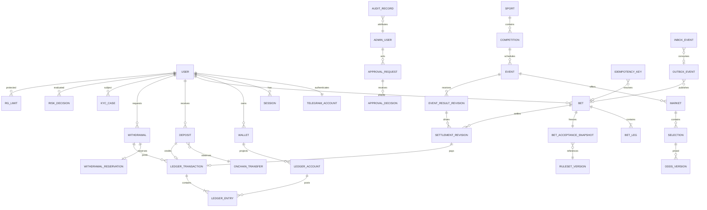

# Database ERD

The diagram shows ownership and financial links, not every operational column.
All mutable aggregates include `version`, timestamps, and environment/tenant
scope where applicable. IDs are UUIDv7-compatible.



## Mandatory database controls

- Deferred constraint trigger validates balanced ledger transactions before
  `POSTED` state; application validation is not sufficient.
- Trigger rejects update/delete of posted ledger transactions and entries.
- Partial unique indexes prevent duplicate effective settlement/payout/credit.
- Foreign keys prevent snapshots and rulesets from disappearing.
- Production roles do not have direct table access from clients/admin UI.
- Partition high-volume odds, audit, webhook, and ledger-entry tables only after
  access patterns are measured; correctness constraints remain global.

## Core tables

```text
identity: users, telegram_accounts, sessions, user_restrictions
sports: sports, competitions, participants, events, provider_mappings
trading: markets, selections, odds_versions, price_publications, suspensions
betting: bet_quotes, bets, bet_legs, bet_acceptance_snapshots, ruleset_versions
settlement: event_result_revisions, settlement_runs, settlement_revisions
finance: assets, wallets, ledger_accounts, ledger_transactions, ledger_entries
payments: asset_networks, deposit_addresses, onchain_transfers, deposits,
          withdrawals, withdrawal_reservations, provider_webhook_events
control: idempotency_keys, outbox_events, inbox_events, audit_records,
         approval_requests, approval_decisions, reconciliation_runs/findings
compliance: kyc_cases, aml_cases, risk_decisions, rg_limits, policy_versions
```
